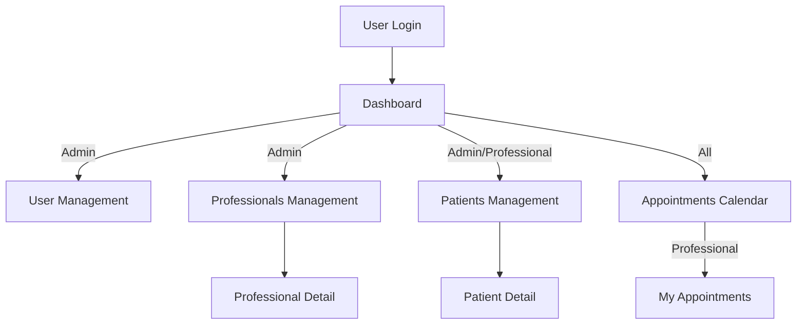
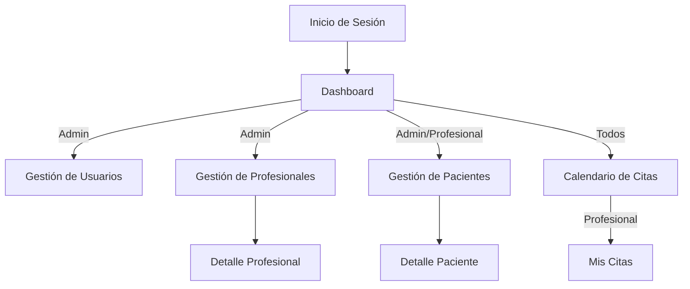

# IronHealth Frontend

---

## 🇬🇧 English

### Collaborative Project
This project is a collaborative effort by **a team of full-stack developer students** and **a lead teacher** (acting as project lead) at Ironhack. It is a real-world, team-based development experience.

---

## Table of Contents
- [Project Overview](#project-overview)
- [Tech Stack](#tech-stack)
- [Installation](#installation)
- [Repository Structure](#repository-structure)
- [App Structure & Workflows](#app-structure--workflows)
- [Main Features](#main-features)
- [Team](#team)

---

## Project Overview
IronHealth is a healthcare management platform for clinics and professionals. It allows for the registration and management of patients, professionals, appointments, and user roles, with a focus on usability and security.

---

## Tech Stack
- **Vue 3** (Composition API)
- **Vite** (build tool)
- **Vuetify 3** (UI framework)
- **Vue Router** (SPA routing)
- **Vue I18n** (internationalization)
- **FullCalendar** (calendar views)
- **Cloudinary** (image uploads)
- **ESLint & Prettier** (code quality)
- **Vercel** (deployment)

---

## Installation
1. **Clone the repository:**
	```sh
	git clone <repo-url>
	cd front-ironhealth
	```
2. **Install dependencies:**
	```sh
	npm install
	```
3. **Environment variables:**
	- Copy `.env.example` to `.env` and set the required variables (e.g., `VITE_API_BASE_URL`).
4. **Run the app in development:**
	```sh
	npm run dev
	```
5. **Build for production:**
	```sh
	npm run build
	```
6. **Lint and format code:**
	```sh
	npm run lint
	npm run format
	```

---

## Repository Structure

```
front-ironhealth/
├── public/                # Static assets
├── src/
│   ├── assets/            # Images, CSS, data (professions, nationalities)
│   ├── components/        # Vue components (forms, lists, calendar, etc.)
│   ├── composables/       # Vue composables (auth, etc.)
│   ├── locales/           # i18n translations (en, es)
│   ├── router/            # Vue Router config
│   ├── services/          # API service layer
│   ├── utils/             # Utility functions
│   └── views/             # Main app views (pages)
├── .vscode/               # Editor config/recommendations
├── .env.example           # Example environment config
├── package.json           # Project metadata & scripts
├── vite.config.js         # Vite config
├── vercel.json            # Vercel deployment config
└── ...
```

---

## App Structure & Workflows

### Main Flows



### Key Views
- **LoginView**: User authentication
- **HomeView**: Landing page
- **PatientsView**: List, add, edit, delete patients
- **ProfessionalsView**: List, add, edit, delete professionals
- **AppointmentsView**: Calendar for appointments
- **MyAppointmentsView**: Personal calendar/history
- **UsersView**: Admin-only user management
- **ProfileView**: User profile & password change

---

## Main Features
- Multi-role authentication (admin, professional, patient)
- Patient and professional registration & management
- Appointment scheduling with calendar view
- User profile management (including password change)
- Internationalization (English/Spanish)
- Responsive, modern UI (Vuetify)
- Image upload via Cloudinary
- Search, filter, and edit in lists
- Alerts and error handling
- Modular, scalable codebase

---

## Team
This project was developed collaboratively by **a team of full-stack developer students** and **a lead teacher** (project lead) at Ironhack.

---

## 🇪🇸 Español

### Proyecto Colaborativo
Este proyecto es el resultado del trabajo conjunto de **un equipo de alumnos desarrolladores full-stack** y **un profesor** (como project lead) en Ironhack. Es una experiencia real de desarrollo en equipo.

---

## Índice
- [Resumen del Proyecto](#resumen-del-proyecto)
- [Stack Tecnológico](#stack-tecnológico)
- [Instalación](#instalación)
- [Estructura del Repositorio](#estructura-del-repositorio)
- [Estructura y Flujos de la App](#estructura-y-flujos-de-la-app)
- [Principales Funcionalidades](#principales-funcionalidades)
- [Equipo](#equipo)

---

## Resumen del Proyecto
IronHealth es una plataforma de gestión sanitaria para clínicas y profesionales. Permite registrar y gestionar pacientes, profesionales, citas y usuarios, con foco en la usabilidad y la seguridad.

---

## Stack Tecnológico
- **Vue 3** (Composition API)
- **Vite** (herramienta de build)
- **Vuetify 3** (UI framework)
- **Vue Router** (ruteo SPA)
- **Vue I18n** (internacionalización)
- **FullCalendar** (vistas de calendario)
- **Cloudinary** (subida de imágenes)
- **ESLint & Prettier** (calidad de código)
- **Vercel** (despliegue)

---

## Instalación
1. **Clona el repositorio:**
	```sh
	git clone <repo-url>
	cd front-ironhealth
	```
2. **Instala las dependencias:**
	```sh
	npm install
	```
3. **Variables de entorno:**
	- Copia `.env.example` a `.env` y configura las variables necesarias (por ejemplo, `VITE_API_BASE_URL`).
4. **Ejecuta la app en desarrollo:**
	```sh
	npm run dev
	```
5. **Build para producción:**
	```sh
	npm run build
	```
6. **Lint y formato de código:**
	```sh
	npm run lint
	npm run format
	```

---

## Estructura del Repositorio

```
front-ironhealth/
├── public/                # Recursos estáticos
├── src/
│   ├── assets/            # Imágenes, CSS, datos (profesiones, nacionalidades)
│   ├── components/        # Componentes Vue (formularios, listas, calendario, etc.)
│   ├── composables/       # Composables Vue (auth, etc.)
│   ├── locales/           # Traducciones i18n (en, es)
│   ├── router/            # Configuración de rutas
│   ├── services/          # Capa de servicios API
│   ├── utils/             # Utilidades
│   └── views/             # Vistas principales (páginas)
├── .vscode/               # Configuración de editor
├── .env.example           # Ejemplo de configuración de entorno
├── package.json           # Metadatos y scripts
├── vite.config.js         # Configuración de Vite
├── vercel.json            # Configuración de despliegue
└── ...
```

---

## Estructura y Flujos de la App

### Flujos principales



### Vistas principales
- **LoginView**: Autenticación de usuario
- **HomeView**: Página de inicio
- **PatientsView**: Listado, alta, edición y baja de pacientes
- **ProfessionalsView**: Listado, alta, edición y baja de profesionales
- **AppointmentsView**: Calendario de citas
- **MyAppointmentsView**: Calendario/historial personal
- **UsersView**: Gestión de usuarios (solo admin)
- **ProfileView**: Perfil de usuario y cambio de contraseña

---

## Principales Funcionalidades
- Autenticación multi-rol (admin, profesional, paciente)
- Registro y gestión de pacientes y profesionales
- Gestión de citas con vista de calendario
- Gestión de perfil de usuario (incluye cambio de contraseña)
- Internacionalización (inglés/español)
- UI moderna y responsive (Vuetify)
- Subida de imágenes vía Cloudinary
- Búsqueda, filtrado y edición en listas
- Alertas y manejo de errores
- Código modular y escalable

---

## Equipo
Proyecto desarrollado colaborativamente por **equipo de alumnos desarrolladores full-stack** y **un profesor** (project lead) en Ironhack.
