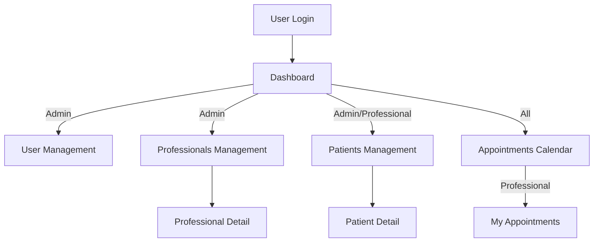
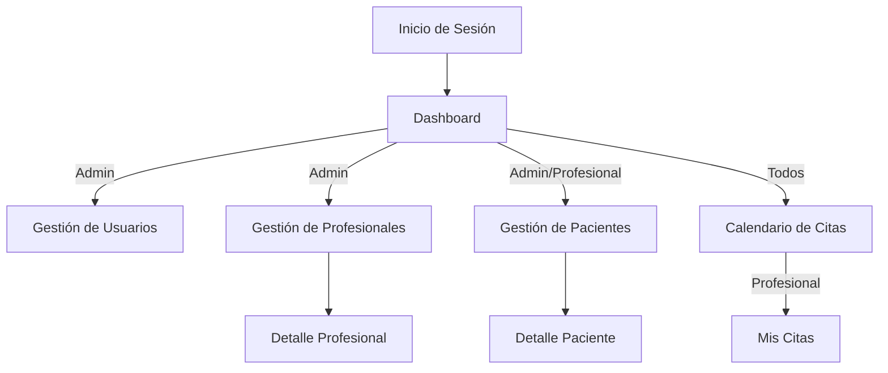

# 🏥 IronHealth - Healthcare Management System

## 🇬🇧 English

## Table of Contents
- [Project Overview](#project-overview)
- [Features](#features)
- [Tech Stack](#tech-stack)
- [App Structure & Workflows](#app-structure--workflows)
- [Project Structure](#project-structure)
- [Getting started](#getting-started)
- [License](#license)
- [Team](#team)

---

## Project Overview
IronHealth is a healthcare management platform for clinics and professionals. It lets teams register and manage patients and healthcare professionals, schedule appointments with a calendar view, and administer users and permissions. Built with Vue 3 + Vuetify, it emphasizes usability, security, internationalization, and seamless integration with a [REST API](https://github.com/IronHack-2025/backend-ironhealth) and FullCalendar.

---

## 🚀 Features

- 🧑‍⚕️ **Patient and Professional Registration & Management**  
  Create, edit, and manage user profiles efficiently.

- 📅 **Appointment Scheduling with Calendar View**  
  Interactive calendar interface for booking and managing appointments.

- 🔐 **Multi-role Authentication**  
  Supports **admin**, **professional**, and **patient** roles with secure access control.

- 👤 **User Profile Management**  
  Update personal information and change passwords easily.

- 🌐 **Internationalization (i18n)**  
  Fully supports **English** and **Spanish** languages.

- 💻 **Responsive, Modern UI (Vuetify)**  
  Optimized for desktop, tablet, and mobile devices.

- 🖼️ **Image Upload via Cloudinary**  
  Secure and fast image hosting and delivery.

- 🔎 **Search, Filter, and Edit in Lists**  
  Quickly locate and manage records with dynamic table views.

- ⚠️ **Alerts and Error Handling**  
  User-friendly feedback for successes, warnings, and errors.

- 🧩 **Modular, Scalable Codebase**  
  Well-structured for easy maintenance and future expansion.

---

## 🛠️ Tech Stack

**Frontend Framework**
- Vue 3 (Composition API)
- Vite (dev server & build)

**UI & Components**
- Vuetify 3 (Material Design components)
- Reusable component library (forms, lists, dialogs)

**Routing**
- Vue Router (SPA routing, protected routes)

**State & Data**
- Vue composables (auth, API services)
- REST API integration (services layer)

**Internationalization**
- Vue I18n (en, es)

**Calendars & Scheduling**
- FullCalendar (calendar views)

**Media & External Services**
- Cloudinary (image uploads)

**Authentication & Security**
- Role-Based Access Control (RBAC)
- Route guards and protected views
- Token-based auth integration with backend (JWT)

**Validation**
- Client-side form validation (HTML5 + custom rules)

**Development Tools**
- ESLint (linting)
- Prettier (code formatting)
- Vite scripts (dev/build)

**Deployment**
- Vercel (static SPA hosting)

---

## 🗂️ Project Structure

```
front-ironhealth/
├── public/                # Static assets
├── src/
│   ├── assets/            # Images, CSS, data (professions, nationalities)
│   ├── components/        # Vue components (forms, lists, calendar, etc.)
│   ├── composables/       # Vue composables (auth, etc.)
│   ├── locales/           # i18n translations (en, es)
│   ├── router/            # Vue Router config
│   ├── services/          # API service layer
│   ├── utils/             # Utility functions
│   └── views/             # Main app views (pages)
├── .vscode/               # Editor config/recommendations
├── .env.example           # Example environment config
├── package.json           # Project metadata & scripts
├── vite.config.js         # Vite config
├── vercel.json            # Vercel deployment config
└── ...
```

---

## 🧭 App Structure & Workflows

### Main Flows



### Key Views
- **LoginView**: User authentication
- **HomeView**: Landing page
- **PatientsView**: List, add, edit, delete patients
- **ProfessionalsView**: List, add, edit, delete professionals
- **AppointmentsView**: Calendar for appointments
- **MyAppointmentsView**: Personal calendar/history
- **PatientSummaryView**: Detailed patient information
- **UsersView**: Admin-only user management
- **ProfileView**: User profile & password change

---

## 🚀 Getting Started

1. **Clone the repository:**
	```sh
	git clone https://github.com/IronHack-2025/front-ironhealth.git

	cd front-ironhealth
	```
2. **Install dependencies:**
	```sh
	npm install
	```
3. **Environment variables:**
	- Copy `.env.example` to `.env` and set the required variables (e.g., `VITE_API_BASE_URL`).
4. **Run the app in development:**
	```sh
	npm run dev
	```
5. **Build for production:**
	```sh
	npm run build
	```
6. **Lint and format code:**
	```sh
	npm run lint
	npm run format
	```

---
## 📝 License

This project was created as part of the Ironhack Web Development Bootcamp curriculum.


## 👥 Team
**Developers**
- [Alejandro Noriega](https://github.com/alenorgue) - Full Stack Developer
- [Christian Baron](https://github.com/ccbaron) - Full Stack Developer
- [Robert Maynou](https://github.com/ErebosXYZ) - Full Stack Developer
- [Juan David Ospina](https://github.com/juandation) - Full Stack Developer
- [Maria Jie Bolós](https://github.com/shimotachi3) - Full Stack Developer
- [Sergio Calvo](https://github.com/SergioCaMi) - Full Stack Developer

**Lead Instructor**
- [Óscar Miras](https://github.com/omiras) - Ironhack Lead Teacher

---

Built with ❤️ during Ironhack's 2025 Web Development Bootcamp


## 🇪🇸 Español

## Índice
- [Resumen del Proyecto](#resumen-del-proyecto)
- [Características](#características)
- [Stack Tecnológico](#stack-tecnológico)
- [Estructura y Flujos de la App](#estructura-y-flujos-de-la-app)
- [Estructura del Proyecto](#estructura-del-proyecto)
- [Cómo empezar](#cómo-empezar)
- [Licencia](#licencia)
- [Equipo](#equipo)

---

## Resumen del Proyecto
 IronHealth es una plataforma de administración para centros de salud y profesionales. Permite registrar y gestionar pacientes y profesionales de la salud, programar citas con una vista de calendario y administrar usuarios y permisos. Construida con Vue 3 + Vuetify, prioriza la experiencia del usuario, la seguridad, la internacionalización y la integración fluida con una [API REST](https://github.com/IronHack-2025/backend-ironhealth) y FullCalendar.

---

## 🚀 Características

- 🧑‍⚕️ **Registro y Gestión de Pacientes y Profesionales**  
  Crea, edita y administra perfiles de usuario eficientemente.

- 📅 **Programación de Citas con Vista de Calendario**  
  Interfaz de calendario interactiva para reservar y gestionar citas.

- 🔐 **Autenticación Multi-rol**  
  Soporta roles de **administrador**, **profesional** y **paciente** con un control de acceso seguro.

- 👤 **Gestión de Perfil de Usuario**  
  Actualiza información personal y cambia la contraseña fácilmente.

- 🌐 **Internacionalización (i18n)**  
  Versión en **inglés** y **español**.

- 💻 **UI Moderna y Responsive (Vuetify)**  
  Optimizada para escritorio, tablet y móvil.

- 🖼️ **Subida de Imágenes con Cloudinary**  
  Alojamiento y publicación de imágenes de forma segura y rápida.

- 🔎 **Búsqueda, Filtro y Edición en Listas**  
  Localiza y gestiona registros con tablas dinámicas.

- ⚠️ **Alertas y Manejo de Errores**  
  Feedback claro e intuitivo para advertencias y errores.

- 🧩 **Código Modular y Escalable**  
  Estructura preparada para su mantenimiento y expansión.

---

## 🛠️ Stack Tecnológico

**Framework Frontend**
- Vue 3 (Composition API)
- Vite (dev server y build)

**UI y Componentes**
- Vuetify 3 (componentes Material Design)
- Librería de componentes reutilizables (formularios, listas, cuadros de diálogo)

**Enrutado**
- Vue Router (SPA, rutas protegidas)

**Estado y Datos**
- Composables de Vue (auth, servicios API)
- Integración con API REST (capa de servicios)

**Internacionalización**
- Vue I18n (en, es)

**Calendarios y Planificación**
- FullCalendar (vistas de calendario)

**Medios y Servicios Externos**
- Cloudinary (subida de imágenes)

**Autenticación y Seguridad**
- Control de Acceso Basado en Roles (RBAC)
- Guards de ruta y vistas protegidas
- Integración de tokens con el backend (JWT)

**Validación**
- Validación en cliente (HTML5 + reglas personalizadas)

**Herramientas de Desarrollo**
- ESLint (linting)
- Prettier (formato de código)
- Scripts de Vite (dev/build)

**Despliegue**
- Vercel (hosting estático de SPA)

---

## 🗂️ Estructura del Proyecto

```
front-ironhealth/
├── public/                # Recursos estáticos
├── src/
│   ├── assets/            # Imágenes, CSS, datos (profesiones, nacionalidades)
│   ├── components/        # Componentes Vue (formularios, listas, calendario, etc.)
│   ├── composables/       # Composables de Vue (auth, etc.)
│   ├── locales/           # Traducciones i18n (en, es)
│   ├── router/            # Configuración de Vue Router
│   ├── services/          # Capa de servicios API
│   ├── utils/             # Funciones utilitarias
│   └── views/             # Vistas principales (páginas)
├── .vscode/               # Configuración/recomendaciones del editor
├── .env.example           # Ejemplo de variables de entorno
├── package.json           # Metadatos y scripts del proyecto
├── vite.config.js         # Configuración de Vite
├── vercel.json            # Configuración de despliegue en Vercel
└── ...
```

---

## 🧭 Estructura y Flujos de la App

### Flujos principales



### Vistas principales
- **LoginView**: Autenticación de usuario
- **HomeView**: Página de inicio
- **PatientsView**: Listado, alta, edición y baja de pacientes
- **ProfessionalsView**: Listado, alta, edición y baja de profesionales
- **AppointmentsView**: Calendario de citas
- **MyAppointmentsView**: Calendario/historial personal
- **PatientSummaryView**: Información detallada del paciente
- **UsersView**: Gestión de usuarios (solo admin)
- **ProfileView**: Perfil de usuario y cambio de contraseña

---

## 🚀 Cómo empezar

1. Clona el repositorio:
    ```sh
    git clone https://github.com/IronHack-2025/front-ironhealth.git

    cd front-ironhealth
    ```
2. Instala las dependencias:
    ```sh
    npm install
    ```
3. Variables de entorno:
    - Copia `.env.example` a `.env` y configura las variables necesarias (por ejemplo, `VITE_API_BASE_URL`).
4. Ejecuta la app en desarrollo:
    ```sh
    npm run dev
    ```
5. Build para producción:
    ```sh
    npm run build
    ```
6. Lint y formateo de código:
    ```sh
    npm run lint
    npm run format
    ```

---

## 📝 Licencia
Este proyecto fue creado como parte del plan de estudios del Bootcamp de Desarrollo Web de Ironhack.

## 👥 Equipo
**Desarrolladores**
- [Alejandro Noriega](https://github.com/alenorgue) - Desarrollador Full Stack
- [Christian Baron](https://github.com/ccbaron) - Desarrollador Full Stack
- [Robert Maynou](https://github.com/ErebosXYZ) - Desarrollador Full Stack
- [Juan David Ospina](https://github.com/juandation) - Desarrollador Full Stack
- [Maria Jie Bolós](https://github.com/shimotachi3) - Desarrolladora Full Stack
- [Sergio Calvo](https://github.com/SergioCaMi) - Desarrollador Full Stack

**Profesor Principal**
- [Óscar Miras](https://github.com/omiras) - Ironhack Lead Teacher

---

Construido con ❤️ durante el Bootcamp de Desarrollo Web 2025 de Ironhack